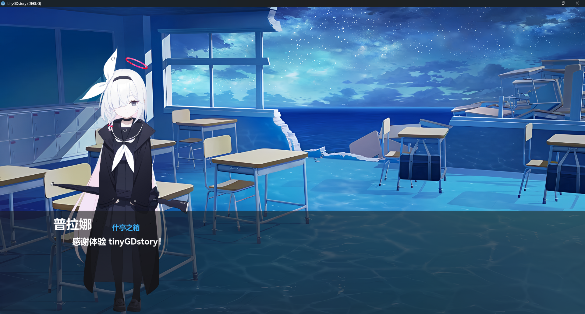

<div align="center">

# tinyGDstory


🌐 **语言:** [English](README.en.md) | 中文

一个基于 Godot 4 开发的轻量级、可移植剧情系统框架。
适用于需要剧情驱动，但并非完全是剧情类的游戏进行播放剧情。
支持并行动画、打字机效果、资源管理及自定义指令扩展。

</div>

## 写在前面

1. 本项目偏向于学习项目，欢迎同样对游戏开发有兴趣的朋友参与
2. 本项目主体为作者古法编程，细节经过AI优化（部分代码注释、部分代码），可能与作者真实想法有矛盾
3. 本项目伴随着作者的独立游戏项目一同开发，后续会进行持续更新维护
4. 作者因学业原因很久没动这个仓库，有重写的计划，~~但所有工作只会在2026年6月9日后逐步开展~~ **重写工作进行中！作者现在时间相当充足！**
5. 欢迎讨论，欢迎参与！

## ✨ 特性

- **JSON 剧本格式**：简单易读的文本剧本，支持版本控制，方便编剧协作。

> 作者最引以为傲的part↓ o(〃＾▽＾〃)o

- **帧并行逻辑**：什么是帧并行逻辑？
传统视觉小说系统通常按顺序执行每个操作：先等背景切换完成，再等角色登场完成，最后才显示对话。这会导致演出有停顿感。本框架采用并行执行：背景切换、角色登场、对话显示同时开始，全部完成后才等待玩家点击。

## 📦 快速开始

1. 克隆本仓库，可以在Godot编辑器中体验Demo。
2. 将 `scene`、`script` 复制到你的godot项目目录。
3. 在 `stage.gd` 中修改初始剧本路径。
4. 按照 `Guilder.md` 编写您的剧情文件 -> [这里](docs/Guilder.md)

## 📂 项目结构

```text
├── scenes/
│   ├── Stage.tscn          # 剧情舞台主场景
│   └── object/
│       └── Character.tscn  # 角色立绘预制体
├── scripts/
│   └── Stage.gd  # 核心剧情控制器
├── source/
│   └── dialogue/           # 剧情文本文件存放处
|   └── character/          # 角色立绘差分
|   └── bgs/                # 背景图片
|   └── sound/              # 音频
|   └── font/               # 字体
└── docs/                   # 文档
```

## 开发方向

本项目目前处于实验阶段，以下计划正在已经在开发日程中~欢迎贡献~

### 当前计划

- 剧情解析、播放系统重写 *（施工中）*
- 剧本格式与表演逻辑重新设计 *（施工中）*

### 未来计划

- UI重新设计
- 图形化编辑器

### 长远方向

- AI-Galgame
